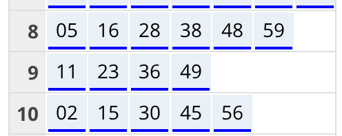

# Proovit88
Otsustasin esmalt laadida alla Eesti GTFS andmestiku ning seda uurida. Kavatsen esmalt teha lihtsama graafiku GTFS andmete põhjal. Andmestik on saadaval: "http://www.peatus.ee/gtfs/" ning juhend: "https://developers.google.com/transit/gtfs/reference/",

Leidsin stops.txt failist vastavad peatused:
| stop_id | stop_code | stop_name | stop_lat    | stop_lon    | zone_id | alias | stop_area | stop_desc | lest_x     | lest_y    | zone_name | authority   |
|---------|-----------|-----------|-------------|-------------|---------|-------|-----------|-----------|------------|-----------|-----------|-------------|
| 822     | 00702-1   | Zoo       | 59.42621424 | 24.65888954 | 822     |       | Haabersti |           | 6587778.16 | 537400.97 | Harju1    | Tallinna TA |
| 1769    | 10902-1   | Toompark  | 59.43682472 | 24.73332737 | 1769    |       | Kesklinn  |           | 6589004.00 | 541613.25 | Harju1    | Tallinna TA |

Vastavad peatused on kindlaks tehtud koordinatide järgi - veendusin, et tegemist on õige suunaga peatustega.

routes.txt põhjal sõidavad Zoo ja Toompargi vahel järgmised liinid:
| route_id | agency_id | route_short_name | route_long_name              | route_type | route_color | competent_authority | route_desc |
|----------|-----------|------------------|------------------------------|------------|-------------|---------------------|------------|
| xxxx     | 56        | 21               | Balti jaam - Landi           | 3          | de2c42      | Tallinna TA         |            |
| xxxx     | 56        | 21B              | Balti jaam - Kakumäe         | 3          | de2c42      | Tallinna TA         |            |
| xxxx     | 56        | 41               | Balti jaam - Landi           | 3          | de2c42      | Tallinna TA         |            |
| xxxx     | 56        | 41B              | Balti jaam - Kakumäe         | 3          | de2c42      | Tallinna TA         |            |
| xxxx     | 56        | 8                | Väike-Õismäe - Äigrumäe      | 3          | de2c42      | Tallinna TA         |            |
| xxxx     | 56        | 92               | ÖÖ Balti jaam - Väike-Õismäe | 3          | de2c42      | Tallinna TA         |            |

Teades õigeid stop_id väärtuseid, võtsin GTFS andmetest välja buss nr 8 kohta käiva graafiku (zoo_toompark_valjumised.csv data -> raw kaustas).
Järgnev graafik tõlgendab saabumised ja väljumised TT:MM formaati (tund-minut).

|  | 1 | 2 | 3 | 4 | 5 | 6 | 7 | 8 | 9 | 10 | 11 | 12 | 13 | 14 | 15 | 16 | 17 | 18 | 19 | 20 | 21 | 22 | 23 | 24 | 25 | 26 | 27 | 28 | 29 | 30 | 31 | 32 | 33 | 34 | 35 | 36 | 37 | 38 | 39 | 40 | 41 | 42 | 43 | 44 | 45 | 46 | 47 | 48 | 49 | 50 | 51 | 52 | 53 | 54 | 55 | 56 | 57 | 58 | 59 | 60 | 61 | 62 | 63 | 64 | 65 | 66 | 67 | 68 | 69 | 70 | 71 | 72 | 73 | 74 | 75 | 76 | 77 | 78 | 79 | 80 | 81 | 82 | 83 | 84 | 85 | 86 | 87 | 88 | 89 |
| - | --- | --- | --- | --- | --- | --- | --- | --- | --- | --- | --- | --- | --- | --- | --- | --- | --- | --- | --- | --- | --- | --- | --- | --- | --- | --- | --- | --- | --- | --- | --- | --- | --- | --- | --- | --- | --- | --- | --- | --- | --- | --- | --- | --- | --- | --- | --- | --- | --- | --- | --- | --- | --- | --- | --- | --- | --- | --- | --- | --- | --- | --- | --- | --- | --- | --- | --- | --- | --- | --- | --- | --- | --- | --- | --- | --- | --- | --- | --- | --- | --- | --- | --- | --- | --- | --- | --- | --- | --- |
| zoo | 05:08 | 05:23 | 05:37 | 05:49 | 06:00 | 06:11 | 06:19 | 06:27 | 06:35 | 06:43 | 06:51 | 07:00 | 07:09 | 07:17 | 07:26 | 07:35 | 07:45 | 07:54 | 08:05 | 08:16 | 08:28 | 08:38 | 08:48 | 08:59 | 09:11 | 09:23 | 09:36 | 09:49 | 10:02 | 10:15 | 10:30 | 10:45 | 10:56 | 11:10 | 11:24 | 11:38 | 11:52 | 12:06 | 12:20 | 12:33 | 12:47 | 13:01 | 13:15 | 13:29 | 13:43 | 13:57 | 14:10 | 14:22 | 14:33 | 14:44 | 14:57 | 15:06 | 15:16 | 15:26 | 15:36 | 15:47 | 15:57 | 16:07 | 16:16 | 16:26 | 16:38 | 16:51 | 17:03 | 17:15 | 17:26 | 17:37 | 17:48 | 18:01 | 18:14 | 18:27 | 18:41 | 18:56 | 19:10 | 19:25 | 19:40 | 19:54 | 20:08 | 20:23 | 20:38 | 20:54 | 21:09 | 21:25 | 21:42 | 21:59 | 22:16 | 22:32 | 22:49 | 23:06 | 23:26 |
| toompark | 05:17 | 05:32 | 05:46 | 05:58 | 06:12 | 06:23 | 06:31 | 06:39 | 06:47 | 06:55 | 07:03 | 07:13 | 07:22 | 07:30 | 07:39 | 07:48 | 07:58 | 08:07 | 08:18 | 08:30 | 08:41 | 08:51 | 09:01 | 09:12 | 09:24 | 09:36 | 09:49 | 10:02 | 10:15 | 10:28 | 10:43 | 10:58 | 11:09 | 11:23 | 11:37 | 11:51 | 12:05 | 12:19 | 12:33 | 12:46 | 13:00 | 13:14 | 13:28 | 13:42 | 13:56 | 14:11 | 14:24 | 14:36 | 14:47 | 14:58 | 15:11 | 15:20 | 15:30 | 15:40 | 15:50 | 16:01 | 16:12 | 16:22 | 16:31 | 16:41 | 16:53 | 17:06 | 17:18 | 17:30 | 17:41 | 17:52 | 18:03 | 18:16 | 18:29 | 18:40 | 18:54 | 19:09 | 19:23 | 19:38 | 19:53 | 20:06 | 20:20 | 20:35 | 20:50 | 21:06 | 21:21 | 21:37 | 21:54 | 22:10 | 22:27 | 22:43 | 23:00 | 23:16 | 23:35 |
| sõit (minutid) | 9 | 9 | 9 | 9 | 12 | 12 | 12 | 12 | 12 | 12 | 12 | 13 | 13 | 13 | 13 | 13 | 13 | 13 | 13 | 14 | 13 | 13 | 13 | 13 | 13 | 13 | 13 | 13 | 13 | 13 | 13 | 13 | 13 | 13 | 13 | 13 | 13 | 13 | 13 | 13 | 13 | 13 | 13 | 13 | 13 | 14 | 14 | 14 | 14 | 14 | 14 | 14 | 14 | 14 | 14 | 14 | 15 | 15 | 15 | 15 | 15 | 15 | 15 | 15 | 15 | 15 | 15 | 15 | 15 | 13 | 13 | 13 | 13 | 13 | 13 | 12 | 12 | 12 | 12 | 12 | 12 | 12 | 12 | 11 | 11 | 11 | 11 | 10 | 9 |
| aeg zoo (sekundid) | 18480 | 19380 | 20220 | 20940 | 21600 | 22260 | 22740 | 23220 | 23700 | 24180 | 24660 | 25200 | 25740 | 26220 | 26760 | 27300 | 27900 | 28440 | 29100 | 29760 | 30480 | 31080 | 31680 | 32340 | 33060 | 33780 | 34560 | 35340 | 36120 | 36900 | 37800 | 38700 | 39360 | 40200 | 41040 | 41880 | 42720 | 43560 | 44400 | 45180 | 46020 | 46860 | 47700 | 48540 | 49380 | 50220 | 51000 | 51720 | 52380 | 53040 | 53820 | 54360 | 54960 | 55560 | 56160 | 56820 | 57420 | 58020 | 58560 | 59160 | 59880 | 60660 | 61380 | 62100 | 62760 | 63420 | 64080 | 64860 | 65640 | 66420 | 67260 | 68160 | 69000 | 69900 | 70800 | 71640 | 72480 | 73380 | 74280 | 75240 | 76140 | 77100 | 78120 | 79140 | 80160 | 81120 | 82140 | 83160 | 84360 |
| aeg toompark (sekundid) | 19020 | 19920 | 20760 | 21480 | 22320 | 22980 | 23460 | 23940 | 24420 | 24900 | 25380 | 25980 | 26520 | 27000 | 27540 | 28080 | 28680 | 29220 | 29880 | 30600 | 31260 | 31860 | 32460 | 33120 | 33840 | 34560 | 35340 | 36120 | 36900 | 37680 | 38580 | 39480 | 40140 | 40980 | 41820 | 42660 | 43500 | 44340 | 45180 | 45960 | 46800 | 47640 | 48480 | 49320 | 50160 | 51060 | 51840 | 52560 | 53220 | 53880 | 54660 | 55200 | 55800 | 56400 | 57000 | 57660 | 58320 | 58920 | 59460 | 60060 | 60780 | 61560 | 62280 | 63000 | 63660 | 64320 | 64980 | 65760 | 66540 | 67200 | 68040 | 68940 | 69780 | 70680 | 71580 | 72360 | 73200 | 74100 | 75000 | 75960 | 76860 | 77820 | 78840 | 79800 | 80820 | 81780 | 82800 | 83760 | 84900 |

Need ajad kattuvad aadressil transport.tallinn.ee saadaval oleva graafikuga:

**Joonis 1.** Kuvatõmmis portaalist transport.tallinn.ee. Liini 8 (Zoo) sõiduplaan.

Uurisin Postman rakenduse abil https://gis.ee/tallinn/ kaardirakendust - sealt on võimalik leida reaalajas andmeid Tallinna busside ja trammide kohta. 
Leidsin endpointi kujul "https://transport.tallinn.ee/siri-stop-departures.php?stopid=xxxx", mille abil on võimalik requestida arvatavat saabumisaega ning tegelikku saabumisaega.

Endpoint väljastab andmeid kujul:

Transport,RouteNum,ExpectedTimeInSeconds,ScheduleTimeInSeconds,65472,version20201024
stop,822
bus,25,65688,65484,Reisisadama D-terminal,216,Z
bus,8,65704,65694,Äigrumäe,232,Z
bus,21,65776,65460,Balti jaam,304,Z
bus,42,65818,65796,Priisle,346,Z
bus,26,65900,65898,Paljassaare,428,Z

Kogusin andmeid kolme päeva väljumiste kohta - eelkõige kl 8 - kl 9 (hilinemised.py). Kogusin andmeid 15.05.2025, 16.05.2025 ja 19.05.2025 - neljapäev, reede, esmaspäev.

# Allikad
Ühistranspordiregistri avaandmed
Ajaline kaetus: 28.05.2018; Uuenemissagedus: iga päev  
Litsents: [CC BY-SA 3.0](https://creativecommons.org/licenses/by-sa/3.0/ee/deed.et)  
URL: https://avaandmed.eesti.ee/datasets/uhistranspordiregistri-avaandmed

Google Transit GTFS Schedule
URL: https://developers.google.com/transit/gtfs/reference/

Joonis 1. Kuvatõmmis portaalist transport.tallinn.ee
URL: https://transport.tallinn.ee/#bus/8/a-b/00702-1
